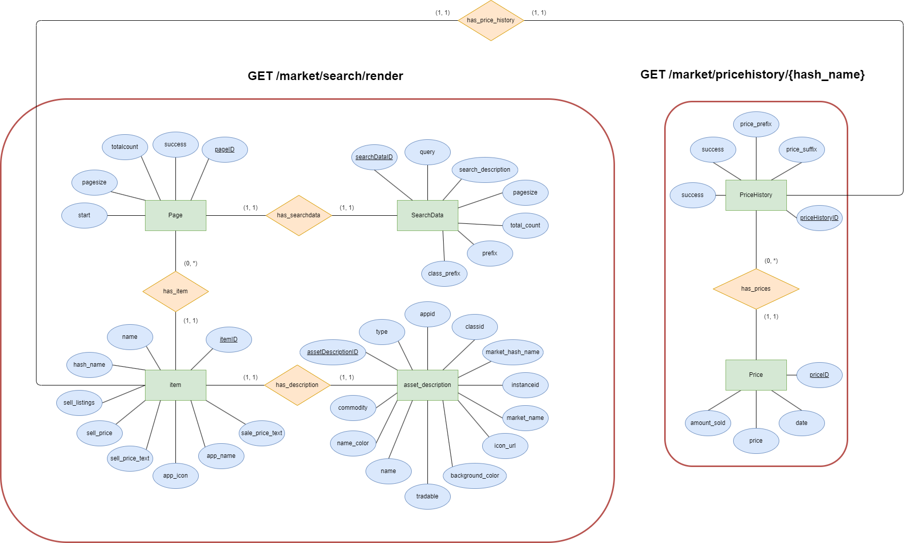
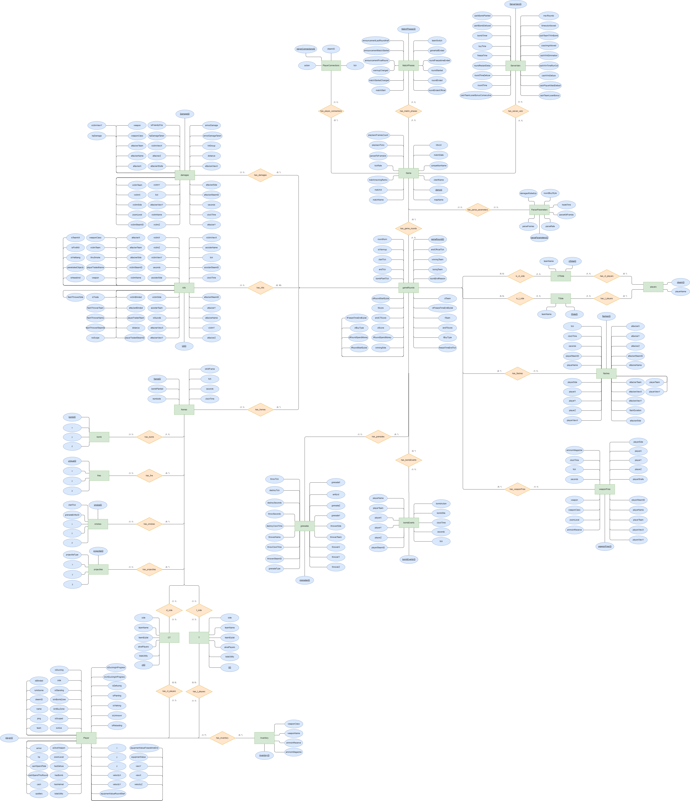

# Databases Project

This repository belongs to the Database System course in the HS Semester 2024 and relates to the personal project: 

## Counter Strike Global Offensive player analysis and its market impact

---

### Datasets

The datasets used for this project are the 
[Esta (Esports Trajectories & Actions)](https://github.com/pnxenopoulos/esta) and the [Steam API](https://github.com/Revadike/InternalSteamWebAPI) documented through an unofficial source.

### Entity relation Diagramms

The following ER-Diagramms depict the setup of the datasets described above.

### Goals

For our goals, we would like to look at common player behavior related to positions, strategies, and actions on different maps and for different teams and analyze these.
Additionally, we would like to find out how the Steam Market is affected by events such as tournaments or even events outside the CS:GO ecosystem.
Finally, we would like to answer the overarching question of how tournaments and player / team performance in these tournaments affect the prices of certain items on the Steam Market.

---

Mathieu Groenen, Jiri Käser